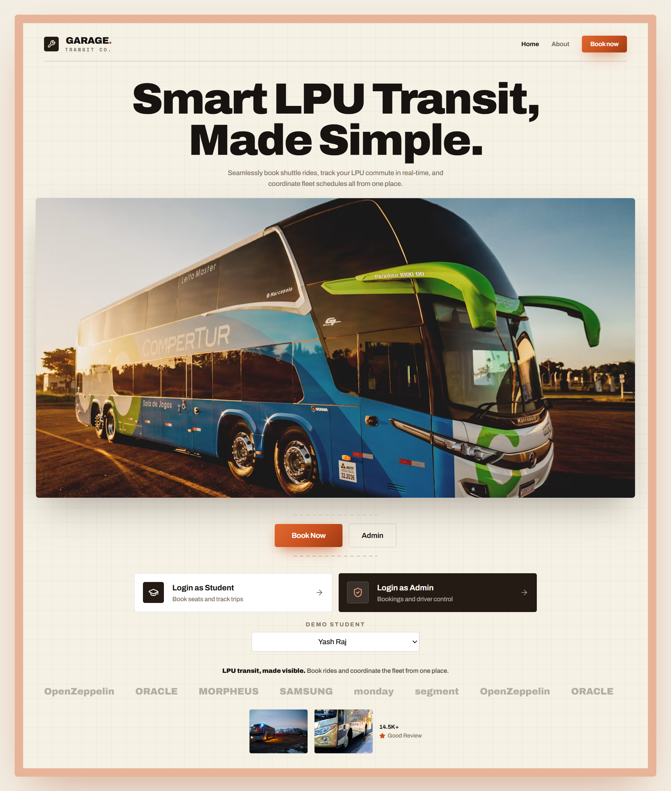
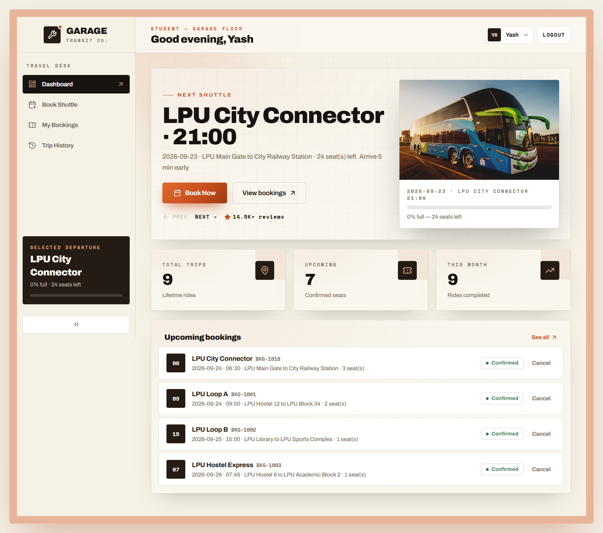
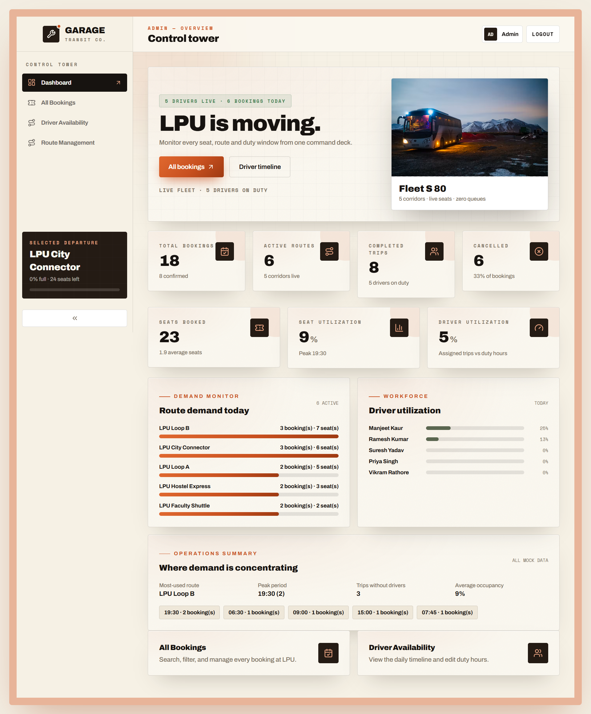
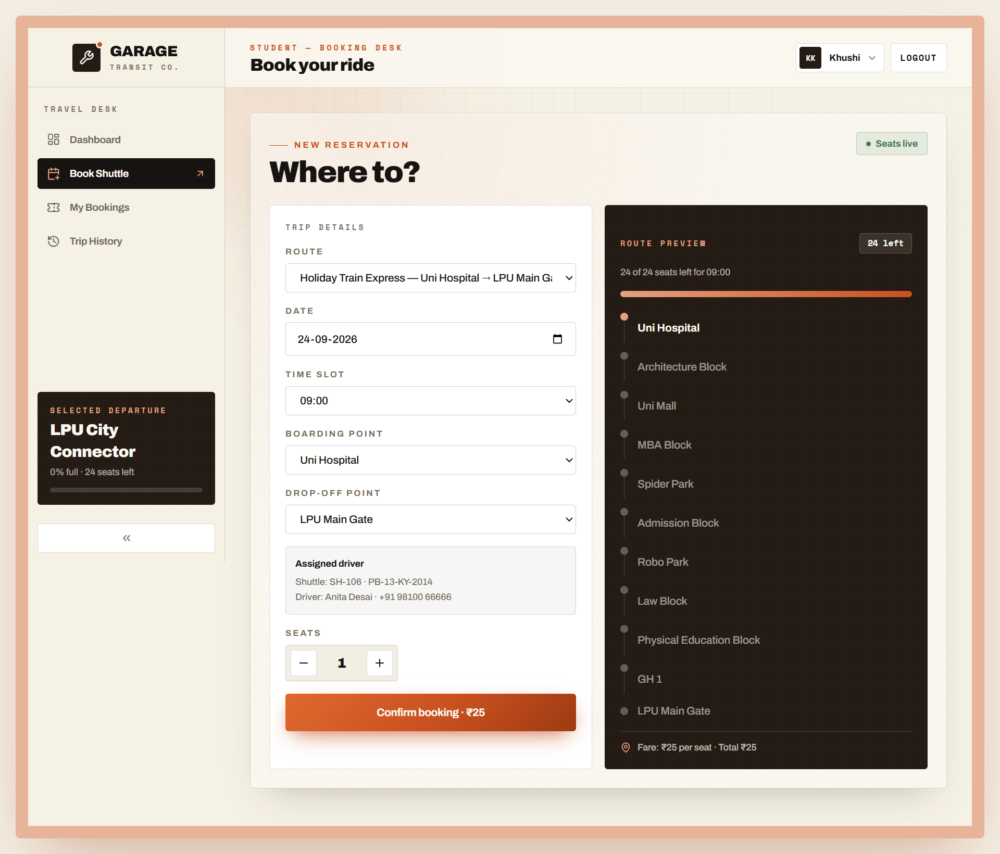
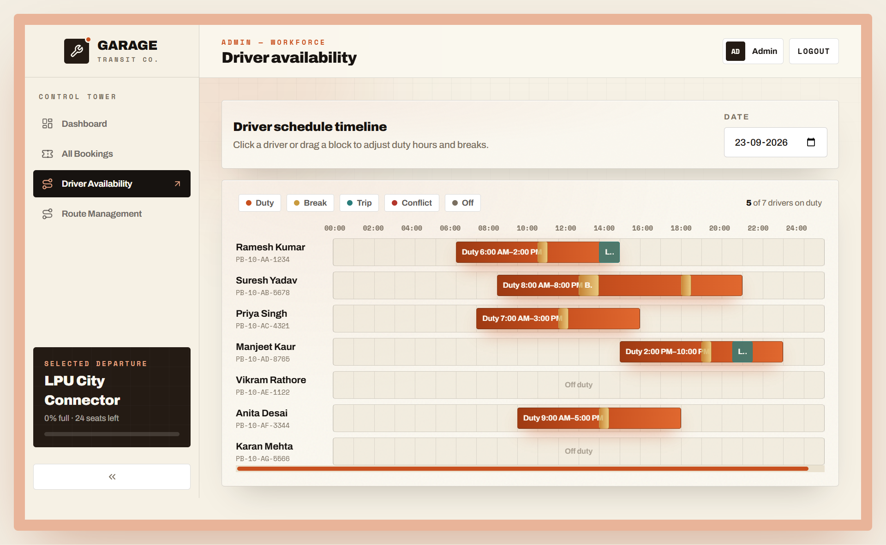
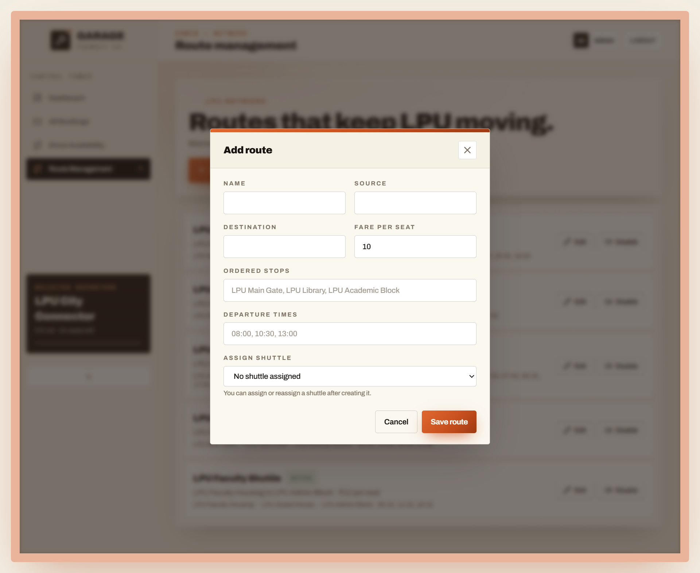

# Shuttle Management System

Smart campus transit booking and operations dashboard for students, staff, and transport administrators. This is a frontend assessment implementation using realistic, date-relative mock data. There is no production backend or authentication service.

<p align="center">
  
</p>
<p align="center"><em>Garage Transit hero experience</em></p>

## Features

### Student workflows

- Book a route with date, scheduled departure, pickup, drop-off, seats, fare, and live capacity.
- Reject past dates, invalid pickup/drop-off combinations, inactive routes, invalid slots, and over-capacity bookings.
- View, edit, and cancel eligible bookings with confirmation and toast feedback.
- Search/filter trip history by route and date range, with driver and vehicle details.
- Dashboard next-shuttle selector derives upcoming departures from active route schedules, excludes passed/full trips, updates occupancy per departure, and opens Book Shuttle with the exact selected trip preselected.
- Student views are scoped to the authenticated demo user. My Bookings contains only that student's active future bookings and offers cancellation only; completed/cancelled records are shown in that student's Trip History.
- Admin routes and reducer actions remain operationally all-user, while student dispatches are restricted to creating their own bookings and cancelling their own eligible bookings.

<p align="center">
  
</p>
<p align="center"><em>Student workflow</em></p>

### Admin workflows

- Search, filter, edit, and status-manage all bookings.
- Assign or clear drivers from bookings using duty, break, and same-slot availability checks.
- Add, edit, enable, and disable routes with ordered stops, fares, and departures.
- View and edit driver duty/break schedules on a 24-hour timeline with half-hour drag snapping.
- Validate duty overlaps, maximum duty length, break duration, break containment, and break overlap.
- Monitor active bookings, seats booked, peak departures, route demand, and driver utilization.

<p align="center">
  
</p>
<p align="center"><em>Admin workflow</em></p>

<p align="center">
  
</p>
<p align="center"><em>Book a ride</em></p>

<p align="center">
  
</p>
<p align="center"><em>Driver availability</em></p>

<p align="center">
  
</p>
<p align="center"><em>Route management</em></p>

## Technology Stack

- React 18 and TypeScript with strict compiler settings
- Vite and npm
- React Router v6 for role-specific routes and lazy page chunks
- Tailwind CSS with custom design tokens
- `lucide-react` icons and a small amount of CSS animation
- React Context plus `useReducer` for in-memory domain state

## Installation and Development

```bash
npm install
npm run dev
```

Open the local URL printed by Vite. Choose **Login as Student** or **Login as Admin**. The login is intentionally a mock role selector and does not require a password.

Production build and preview:

```bash
npm run build
npm run preview
```

Only `dev`, `build`, and `preview` scripts are currently configured. Automated tests and linting are not yet configured.

## Project Structure

```text
src/
  App.tsx                    Role-based route tree and lazy pages
  main.tsx                   Provider tree and BrowserRouter
  types/                     Shared domain types
  data/mockData.ts           Seed routes, drivers, bookings, and trips
  context/                   App reducer, role context, and toast context
  utils/                     Dates, seats, booking/route/schedule/assignment validation, analytics
  utils/departures.ts        Derived bookable departures and trip identity/time checks
  services/                  Replaceable mock repository boundary
  components/                Reusable forms, tables, timeline, layout, dialogs
  pages/user/                Student dashboard, booking, bookings, trip history
  pages/admin/                Admin dashboard, bookings, drivers, routes
```

## Mock Data and State

`src/data/mockData.ts` creates date-relative seed data when the application module loads. `AppContext` owns the current routes, drivers, bookings, and trips. Reducer actions update that state in memory, so a refresh restores the seed data. The current reducer actions are intentionally shaped so a repository/service layer can later replace the mock implementation with REST or GraphQL calls.

The seeded data includes five campus routes, seven drivers with generated schedules, bookings across multiple statuses, and trip-history records. Shuttle capacity is 24 seats. Assignment uses the driver's vehicle number as the demo shuttle identifier.

`src/utils/departures.ts` derives a 14-day bookable departure inventory from active route schedules and current bookings. Each departure is keyed by `routeId:date:timeSlot`; elapsed and full departures are excluded. The 14-day horizon is a mock-data limitation until a real departure API exists.

## Roles and Main Workflows

- **Student:** login -> Book Shuttle -> choose route/date/departure/pickup/drop-off/seats -> confirm -> manage My Bookings -> review Trip History.
- **Admin:** login -> Control Tower -> inspect demand and utilization -> All Bookings -> edit status or assign an available driver -> Driver Availability -> edit a schedule -> Route Management -> maintain route availability.

## Important Design Decisions

- Business rules are kept in pure utilities (`validation.ts`, `seat.ts`, and `analytics.ts`) where possible, making them independently testable when a test runner is added.
- UI components use shared forms, dialogs, status badges, and feedback rather than duplicating interaction patterns.
- Route stops are ordered. A booking stores pickup and drop-off snapshots so the displayed reservation remains understandable if a route is later edited.
- Disabled routes remain visible to administrators but are removed from new-booking choices.
- Driver assignment checks one-hour trip coverage, duty coverage, break coverage, and overlapping assignments. A production API must repeat these checks transactionally.
- Assigned bookings are projected onto the driver timeline as read-only trip blocks; conflicts are highlighted without mutating duty/break blocks.
- The Sidebar's selected-departure card consumes the same selected shuttle context as the dashboard carousel, so route, occupancy, and available seats stay synchronized.
- Historical trips store pickup/drop-off, booking linkage where seeded, driver, vehicle, fare, status, and shuttle snapshots so route edits do not rewrite past displays.

## Complexity Considerations

- Booking and trip filtering are linear, `O(n)`, with `O(n)` result space; sorting filtered history is `O(m log m)`.
- Upcoming departure derivation is `O(D * R * S * B)` in the current mock implementation for `D` dates, `R` routes, `S` slots, and `B` bookings because the existing capacity helper is reused per departure; an indexed occupancy map would reduce repeated booking scans.
- Departure navigation is `O(1)` per click after the derived list is built, and Book Now revalidates against the current derived list in `O(U)` for `U` upcoming departures.
- Seat availability currently filters and reduces bookings in `O(n)` time. A production system can maintain an indexed occupancy key `(route, date, slot)` for faster reads.
- Driver availability checks each candidate's duty/break windows and assigned trips in `O(d * (b + a))` for `d` drivers, `b` schedule blocks, and `a` assignments; the current seeded dataset is intentionally small.
- Schedule conflict validation is linear over the driver's blocks and assignments for one proposed one-hour trip, `O(b + a)`.
- Dashboard demand aggregation uses `Map` structures in one pass, `O(n + r + d)` time and `O(r + s + d)` additional space for bookings, routes, slots, and drivers.

## Known Limitations and Future Improvements

- State is in memory only; there is no backend, persistence, server-side validation, or real-time tracking.
- Login is a demonstration role switch, not authentication or authorization.
- Trip history is seeded separately from bookings and does not yet model live trip progression or update automatically from booking status changes.
- Tests, linting, CI, and API loading states should be added for production readiness. An application-level error boundary and modal focus handling are already present.
- Future work should add real shuttle/vehicle entities, persistence, richer demand charts, and server-backed identity.

## Assessment Verification

The configured production command currently passes:

```text
npm run build  # TypeScript compilation + Vite production bundle
```

No test or lint command exists in `package.json` yet. See `Audit.md` for the complete requirement matrix and post-implementation status.

## Demo Instructions

1. Log in as Student, create a booking, then try a past date or reverse-ordered drop-off to show inline validation.
2. Edit and cancel an upcoming booking, then filter Trip History by status, route, date, and search text.
3. Log in as Admin and review total bookings, completed trips, cancellations, seat utilization, peak periods, route demand, unassigned trips, and driver utilization.
4. Open All Bookings, assign an available driver, then try a conflicting assignment to show rejection.
5. Open Driver Availability, inspect assigned trip blocks, add a duty/break, move a break between duty windows, and attempt an invalid overlap.
6. Open Route Management, add/edit a route, try duplicate names or duplicate stops, then disable it and confirm it disappears from new booking choices.
